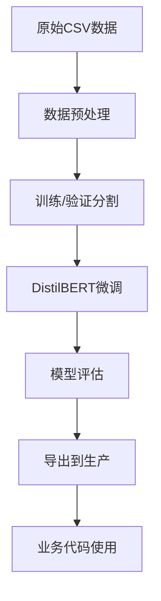

# 🤖 BERT意图分类训练工作区

这是一个独立的训练工作区，专门用于训练篮球问答系统的意图分类模型，与业务代码完全分离。

## 🏗️ 目录结构

```
training/
├── data/
│   ├── raw/                          # 原始训练数据
│   ├── processed/                    # 预处理后的数据
│   └── README.md                     # 数据说明
├── scripts/
│   ├── prepare_data.py              # 数据预处理脚本
│   ├── train_intent_bert.py         # BERT训练脚本
│   ├── evaluate_model.py            # 模型评估脚本
│   └── export_model.py              # 模型导出脚本
├── configs/
│   ├── bert_config.yaml             # 训练配置
│   └── data_config.yaml             # 数据配置
├── logs/                            # 训练日志 (自动生成)
└── requirements_training.txt        # 训练专用依赖
```

## 🚀 快速开始

### 1. 安装训练依赖

```bash
cd training
pip install -r requirements_training.txt
```

### 2. 准备训练数据

将您的训练数据文件命名为 `english_fine_grained_training_dataset.csv`，放入 `data/raw/` 目录。

数据格式要求：
```csv
text,label
"How old is Kobe Bryant?","attribute_query"
"Compare LeBron and Jordan","comparison"
...
```

### 3. 数据预处理

```bash
python scripts/prepare_data.py configs/data_config.yaml configs/bert_config.yaml
```

这个步骤会：
- 清洗和标准化数据
- 映射标签到统一的5类系统
- 分割训练/验证集 (80/20)
- 生成JSON格式的训练文件

### 4. 训练BERT模型

```bash
python scripts/train_intent_bert.py configs/bert_config.yaml
```

训练过程包括：
- 加载DistilBERT预训练模型
- 微调到篮球意图分类任务
- 自动早停和最佳模型保存
- 生成详细的训练日志

### 5. 评估模型

```bash
python scripts/evaluate_model.py ../models/intent_classifier/v1.0/final
```

评估内容：
- 在验证集上计算准确率、F1等指标
- 生成分类报告和混淆矩阵
- 测试自定义样例
- 分析预测置信度

### 6. 导出到生产环境

```bash
python scripts/export_model.py v1.0
```

这会将训练好的模型整理到生产可用的格式。

## ⚙️ 配置说明

### bert_config.yaml - 训练配置
- **模型参数**: 基础模型、最大长度、标签数量
- **训练参数**: 批次大小、学习率、训练轮数
- **输出设置**: 模型保存路径、日志配置
- **早停设置**: 防止过拟合

### data_config.yaml - 数据配置
- **数据路径**: 原始数据和处理后数据的路径
- **字段映射**: 指定文本和标签列名
- **预处理参数**: 文本长度限制、去重等
- **标签映射**: 原始标签到目标5类的映射规则

## 🎯 5类意图分类系统

| 意图类别 | 描述 | 示例查询 |
|---------|------|----------|
| `ATTRIBUTE_QUERY` | 单实体属性查询 | "How old is Kobe Bryant?" |
| `SIMPLE_RELATION_QUERY` | 简单关系查询 | "Did Kobe and Shaq play together?" |
| `COMPARATIVE_QUERY` | 比较查询 | "Compare LeBron James and Michael Jordan" |
| `DOMAIN_CHITCHAT` | 篮球领域闲聊 | "I love watching basketball games" |
| `OUT_OF_DOMAIN` | 领域外查询 | "What's the weather today?" |

## 📊 训练流程图



## 🔧 自定义和扩展

### 修改标签系统
1. 在 `bert_config.yaml` 中修改 `labels` 部分
2. 在 `data_config.yaml` 中更新 `label_mapping`
3. 重新运行预处理和训练

### 调整模型参数
编辑 `bert_config.yaml` 中的 `training` 部分：
- `batch_size`: 批次大小 (取决于GPU内存)
- `learning_rate`: 学习率 (建议2e-5到5e-5)
- `num_epochs`: 训练轮数 (建议3-5轮)

### 使用其他模型
修改 `bert_config.yaml` 中的 `model.name`：
- `bert-base-uncased`: 更大但更准确
- `roberta-base`: RoBERTa模型
- `albert-base-v2`: ALBERT模型

## 📈 性能优化建议

### 硬件要求
- **CPU**: 至少4核，推荐8核以上
- **内存**: 至少8GB，推荐16GB以上  
- **GPU**: 可选，但能显著加速训练 (推荐4GB显存以上)

### 训练加速
1. **启用FP16**: 在 `bert_config.yaml` 中设置 `fp16: true`
2. **增加批次大小**: 如果内存允许，增加 `batch_size`
3. **使用GPU**: 确保PyTorch检测到CUDA

### 提升准确率
1. **增加训练数据**: 每类至少500个样本
2. **数据增强**: 通过同义词替换等方式增加样本
3. **调整学习率**: 尝试不同的学习率设置
4. **增加训练轮数**: 但注意防止过拟合

## 🔍 故障排除

### 常见问题

**Q: 训练过程中出现CUDA内存不足**
A: 减少 `batch_size` 或使用 `gradient_accumulation_steps`

**Q: 验证准确率不高**
A: 检查标签映射是否正确，增加训练数据，调整超参数

**Q: 模型预测置信度普遍较低**
A: 可能需要更多训练数据或调整模型结构

**Q: 训练过程中loss不下降**
A: 尝试降低学习率或检查数据标签是否正确

### 日志分析
训练日志包含：
- 损失函数变化
- 验证指标
- 学习率调度
- 模型保存检查点

## 📞 支持与反馈

这个训练工作区设计为独立且可复用的组件。如果需要：
- 添加新的意图类别
- 优化模型性能
- 集成到其他项目

可以基于现有框架进行扩展。
